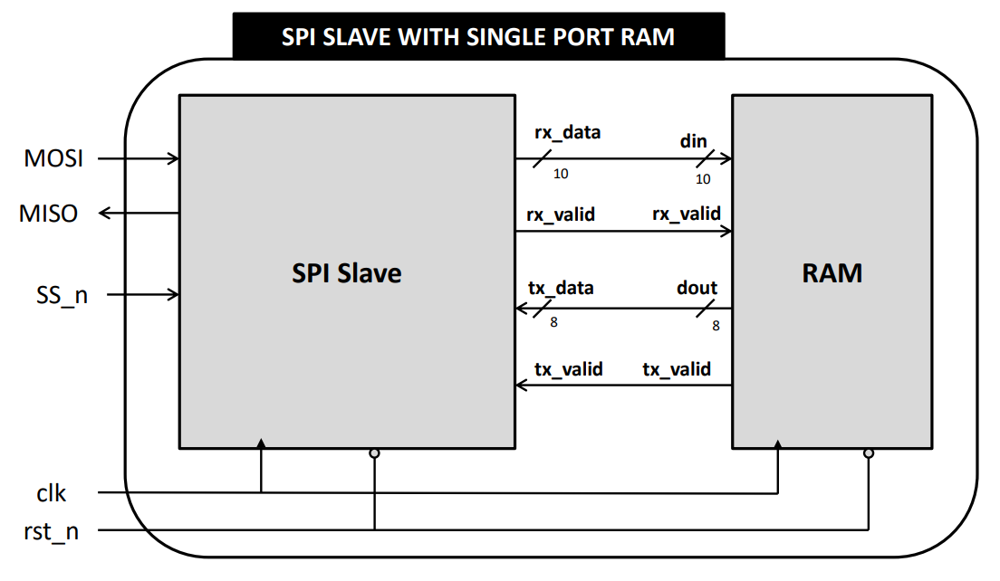
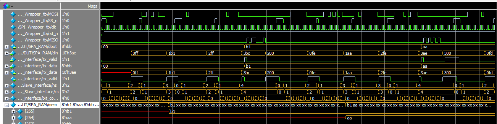
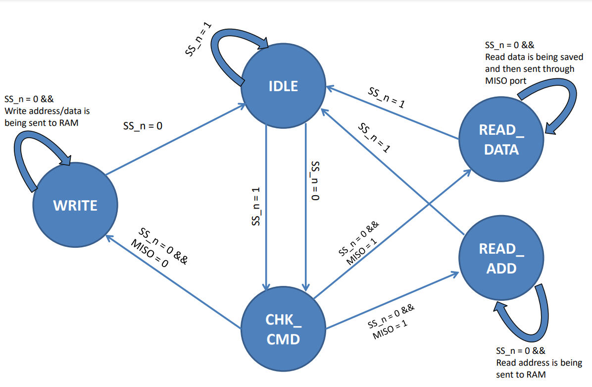

# SPI-RAM Interface

This project implements an SPI Slave module connected to a Single-Port Asynchronous RAM.  
It enables read/write operations via SPI protocol and stores/retrieves data from RAM.

---

## Features
- SPI Slave functionality (MISO/MOSI/SS)
- Single-Port Asynchronous RAM storage
- Separate Read and Write address handling
- Modular and reusable Verilog code

---

## Block Diagram
Below is the block diagram of the SPI-RAM interface system:

---

## SPI Slave Module

The **SPI Slave** module receives data from the master device and interacts with the RAM module.

### Ports

| Name     | Type   | Size   | Description |
|----------|--------|--------|-------------|
| clk      | Input  | 1 bit  | Clock signal |
| rst_n    | Input  | 1 bit  | Active low reset signal |
| SS_n     | Input  | 1 bit  | Slave Select signal |
| MOSI     | Input  | 1 bit  | Master-Out-Slave-In data signal |
| tx_data  | Input  | 10 bit | Transfer data output signal. Captures MOSI data for 10 clock cycles and stores it to send to RAM. |
| tx_valid | Input  | 1 bit  | Indicates when `tx_data` is valid |
| MISO     | Output | 1 bit  | Master-In-Slave-Out data signal |
| rx_data  | Output | 10 bit | Received data from the memory |
| rx_valid | Output | 1 bit  | Indicates when `rx_data` is valid |

---

## Single Port Async RAM Module

The **Single Port Asynchronous RAM** implements a memory block with a single data port.

### Parameters
- **MEM_DEPTH** (default: 256): Depth of the memory.
- **ADDR_SIZE** (default: 8): Size of the memory address.

### Ports

| Name     | Type   | Size   | Description |
|----------|--------|--------|-------------|
| clk      | Input  | 1 bit  | Clock signal |
| rst_n    | Input  | 1 bit  | Active low reset signal |
| din      | Input  | 10 bit | Data input |
| rx_valid | Input  | 1 bit  | If HIGH, accepts `din[7:0]` to save write/read address or writes memory depending on `din[9:8]` |
| dout     | Output | 8 bit  | Data output |
| tx_valid | Output | 1 bit  | HIGH when a memory read is performed |

---

### Command Encoding (`din[9:8]`)
| Command Bits | Operation | Description |
|--------------|-----------|-------------|
| `00` | Write Address | Holds `din[7:0]` internally as write address |
| `01` | Write Data | Writes `din[7:0]` to memory at the held write address |
| `10` | Read Address | Holds `din[7:0]` internally as read address |
| `11` | Read Data | Reads memory at held read address. `tx_valid` HIGH, `dout` holds data. |

---

### Wire Connections
- `rx_data` (SPI Slave) → `din` (RAM)
- `rx_valid` (SPI Slave) → `rx_valid` (RAM)
- `dout` (RAM) → `tx_data` (SPI Slave)
- `tx_valid` (RAM) → `tx_valid` (SPI Slave)

---

## Waveform
Sample simulation waveform showing SPI transactions and RAM operations:

---
## Finite State Machine (FSM)

The SPI Slave module is implemented as a finite state machine (FSM) to control data flow between the SPI interface and the RAM module.  
It operates in **five main states**:

1. **IDLE** – Waits for the Slave Select (`SS_n`) signal to go low, indicating the start of communication.
2. **CHK_CMD** – Receives and interprets the command bits from MOSI.
3. **WRITE** – Writes incoming data to the RAM.
4. **READ_ADDR** – Captures the address from which data will be read.
5. **READ_DATA** – Sends requested data back to the SPI master via MISO.

### FSM State Diagram

---

### State Transition Summary
| Current State | Condition                          | Next State    |
|---------------|------------------------------------|--------------|
| IDLE          | `SS_n == 0`                        | CHK_CMD      |
| CHK_CMD       | bit count complete, command decode | WRITE / READ_ADDR / READ_DATA |
| WRITE         | `SS_n == 1`                        | IDLE         |
| READ_ADDR     | `SS_n == 1`                        | IDLE         |
| READ_DATA     | Data sent                          | IDLE         |

---

## File Descriptions
- **`SPI_SLAVE.v`** → Verilog module for SPI slave communication.
- **`Single_port_Async_RAM.v`** → Verilog module for single-port asynchronous RAM.
- **`README.md`** → Project documentation.
- **`images/`** → Contains diagrams and waveform images.

---

## How to Run Simulation
1. Open your preferred HDL simulator (ModelSim, Vivado, etc.).
2. Add both `SPI_SLAVE.v` and `Single_port_Async_RAM.v` to the project.
3. Include your testbench file.
4. Compile and simulate to observe waveforms.

---

## Author
**Mariam Hossam**  
[GitHub Profile](https://github.com/Mariam-hossam9)

---
